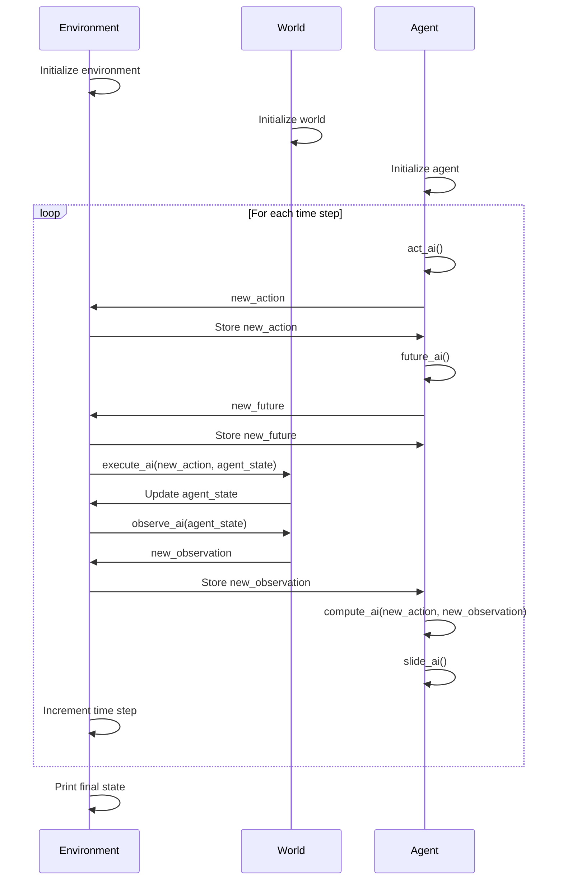

# MountainCarAI

This project implements Active Inference agents in an Environment for the Mountain Car problem using the RxInfer.jl package.



## Installation

### Install Julia
https://julialang.org/downloads/

### Download Source
* Clone this repository
* Navigate to the project directory

## Run

Start Julia and activate the project:

```julia
using Pkg; Pkg.activate("."); Pkg.instantiate()

# To run the example with two agents:
include("examples/run.jl")
```

## Run Tests
```julia
using Pkg
Pkg.test()
```

## Acknowledgments
* Based on the [Active Inference Mountain car example](https://github.com/ReactiveBayes/RxInfer.jl/blob/main/examples/advanced_examples/Active%20Inference%20Mountain%20car.ipynb) from RxInfer.jl